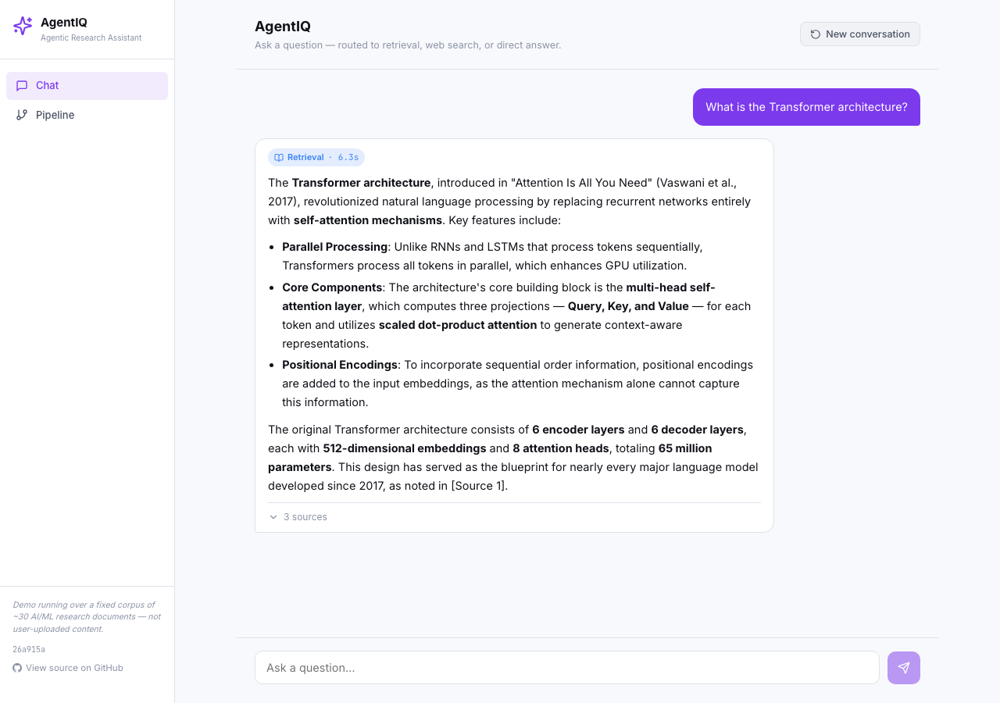

# AgentIQ — Multi-Step Agentic Research Assistant

> An agentic AI system that autonomously routes queries between document retrieval, vector search, and live web search to generate grounded, cited answers.


[](https://github.com/vamsi513/agentiq/actions/workflows/ci.yml)

---

## Live Demo

**[AgentIQ (Next.js)](https://agentiq-platform.vercel.app)** — streaming chat UI; the browser never talks to the FastAPI backend directly, it calls Next.js server-side API routes (`frontend/app/api/chat/`) which proxy to it

**[AgentIQ on Streamlit Cloud](https://agentiq-qgjmzy665qcpysoctz7app.streamlit.app)** — original UI, also supports PDF upload



---

## Screenshots

### Next.js chat UI


### Streamlit app overview


---

## Architecture

```
                              User Query
                                  │
                                  ▼
                             Router Node
                      (LLM classifies query intent)
                     ┌────────────┼─────────────┐
                     ▼            ▼              ▼
                  FAISS       Tavily Web     Direct Node
              (local corpus)    Search       (GPT-4o-mini)
                     │            │               │
                     └─────┬──────┘               │
                           ▼                       │
                    Generator Node                 │
           (synthesises context → cited answer)    │
                           │                        │
                           └───────────┬────────────┘
                                       ▼
                      Streamed Response + Citations
                        (via FastAPI SSE / Streamlit)
```

Direct route answers from the LLM's own knowledge and goes straight to the
response — it does not pass through the Generator Node (no retrieval context
exists to synthesise for conversational/general-knowledge queries).

- **Memory:** MemorySaver checkpoints every turn → full multi-turn history per session
- **Observability:** LangSmith traces every graph run end-to-end (when `LANGCHAIN_API_KEY` is configured)

---

## Features

- **Multi-step agentic reasoning** with LangGraph StateGraph — router, retriever, web search, and generator nodes wired with conditional edges
- **FAISS retrieval** — the only backend the live agent queries, with L2-normalized embeddings for cosine similarity. `retrieval/pinecone_store.py` and `retrieval/llamaindex_loader.py` are standalone reference implementations of alternative backends — neither is wired into `agent/nodes.py`, so switching to them today would mean calling their functions directly rather than flipping a config flag
- **In-process session memory** with LangGraph MemorySaver checkpointing across all turns in a session (process-local; not persisted across restarts)
- **Real-time streaming responses** via FastAPI Server-Sent Events (SSE) with token-level output
- **LangSmith observability** — every graph run is traced end-to-end with inputs, outputs, latency, and token usage, when `LANGCHAIN_API_KEY` is configured (not required to run the app)
- **RAGAS evaluation** — answer relevance **0.73**, faithfulness **0.69** across 50 queries spanning retrieval, direct-answer, and web search routes
- **PDF upload** (Streamlit app only, not the public Next.js demo) — users can upload their own PDFs; text is extracted, chunked, and indexed into FAISS at runtime
- **LoRA fine-tuning notebook** — `notebooks/finetune_lora.ipynb` demonstrates full PEFT/LoRA fine-tuning on a custom Q&A dataset
- **Kubernetes manifests** — `k8s/` directory contains Deployment, Service/Ingress, and HPA manifests as a deployment reference
- **API rate limiting** — 30 requests/minute per IP enforced at the FastAPI layer; trusted-proxy-aware `X-Forwarded-For` handling for deployments behind nginx. In-process only — correct for the current single-instance deployment, but would need a shared store (Redis, etc.) to mean anything across multiple replicas

---

## Tech Stack

| Category | Technology |
|---|---|
| Agent Orchestration | LangGraph 0.2.28 |
| LLM Abstraction | LangChain 0.3.7 |
| Language Model | OpenAI GPT-4o-mini |
| Embeddings | sentence-transformers all-MiniLM-L6-v2 |
| Vector Store | FAISS faiss-cpu 1.13.0 — the only backend the live agent actually queries |
| Web Search | Tavily Search API |
| Observability | LangSmith |
| Backend API | FastAPI 0.115.4 + uvicorn |
| Streaming | Server-Sent Events (SSE) |
| Data Validation | Pydantic v2 |
| Frontend | Streamlit 1.40.0 |
| Evaluation | RAGAS |
| Fine-tuning | PEFT / LoRA (Hugging Face) |
| Container Orchestration | Kubernetes (Deployment + HPA + Ingress) |
| Testing | pytest |
| Language | Python 3.11 |

---

## Quick Start

### 1. Clone the repository

```bash
git clone https://github.com/vamsi513/agentiq.git
cd agentiq
```

### 2. Create a virtual environment

```bash
python -m venv .venv
source .venv/bin/activate        # macOS / Linux
# .venv\Scripts\activate         # Windows
```

### 3. Install dependencies

```bash
pip install -r requirements.txt
```

### 4. Configure environment variables

```bash
cp .env.example .env
# Edit .env and add your API keys
```

### 5. Run the Streamlit app

```bash
streamlit run app.py
```

The app opens at `http://localhost:8501`. The FAISS index is built automatically on first run (~30 seconds).

### 6. (Optional) Run the FastAPI backend separately

```bash
uvicorn api.main:app --host 0.0.0.0 --port 8000 --reload
```

API docs at `http://localhost:8000/docs`.

### 7. Run tests

```bash
pytest tests/ -v
```

---

## Environment Variables

```env
# Required
OPENAI_API_KEY=sk-your-openai-api-key-here
TAVILY_API_KEY=tvly-your-tavily-api-key-here

# Observability (optional)
LANGCHAIN_API_KEY=your-langsmith-api-key
LANGCHAIN_TRACING_V2=true
LANGCHAIN_PROJECT=agentiq

# Pinecone (optional — reference implementation only, not wired into the live agent)
PINECONE_API_KEY=your-pinecone-api-key
PINECONE_INDEX=agentiq-docs
PINECONE_ENV=us-east-1

# API security (optional — unset means open/dev mode)
AGENTIQ_API_KEY=                    # requires X-API-Key header when set
ALLOWED_ORIGINS=                    # comma-separated CORS origins; unset allows all
TRUSTED_PROXY_IPS=127.0.0.1         # proxies trusted to set X-Forwarded-For

# Model defaults
OPENAI_MODEL=gpt-4o-mini
EMBEDDING_MODEL=all-MiniLM-L6-v2
MAX_TOKENS=1024
TEMPERATURE=0.2
TOP_K_RETRIEVAL=5
MAX_WEB_RESULTS=5
LOG_LEVEL=INFO
```

---

## Project Structure

```
agentiq/
├── app.py                          # Streamlit frontend entry point
├── frontend/                       # Next.js chat UI (proxies to the FastAPI backend via server-side API routes)
│   ├── app/page.tsx                # Chat interface — streaming, route badges, sources
│   ├── app/pipeline/page.tsx       # Architecture explainer page
│   └── app/api/chat/               # Server-side proxy routes (chat, chat/stream)
├── config.py                       # Central config — loads from .env
├── requirements.txt                # Pinned runtime dependencies
├── Dockerfile                      # Container image
├── agent/
│   ├── graph.py                    # LangGraph StateGraph with conditional routing
│   ├── nodes.py                    # Router, retriever, web_search, generator nodes
│   ├── state.py                    # AgentState TypedDict
│   └── memory.py                   # MemorySaver + thread management
├── retrieval/
│   ├── vectorstore.py              # FAISS index: build, persist, query
│   ├── embeddings.py               # sentence-transformers wrapper
│   ├── llamaindex_loader.py        # LlamaIndex VectorStoreIndex (reference only, not wired in)
│   ├── pinecone_store.py           # Pinecone cloud vector store (reference only, not wired in)
│   └── documents/
│       └── sample_docs.txt         # 30 AI/ML research documents
├── observability/
│   └── langsmith_tracer.py         # LangSmith tracing: setup, trace_run, feedback
├── tools/
│   └── web_search.py               # Tavily API wrapper
├── api/
│   ├── main.py                     # FastAPI app — /chat, /chat/stream, /health
│   ├── schemas.py                  # Pydantic request/response models
│   └── streaming.py                # SSE streaming helper
├── k8s/
│   ├── deployment.yaml             # Kubernetes Deployment + PVC
│   ├── service.yaml                # ClusterIP Service + Nginx Ingress
│   └── hpa.yaml                    # HorizontalPodAutoscaler (2–8 replicas)
├── notebooks/
│   └── finetune_lora.ipynb         # LoRA/PEFT fine-tuning walkthrough
├── evaluation/
│   ├── eval_runner.py              # RAGAS evaluation pipeline
│   └── test_queries.json           # 50 curated QA pairs
└── tests/
    ├── test_agent.py
    ├── test_api.py
    ├── test_retrieval.py
    ├── test_streaming.py           # SSE token-filtering regression tests
    └── test_tools.py
```

---

## Evaluation Results

Evaluated on 50 test queries spanning all three routing paths — retrieval, direct-answer, and web search — using RAGAS.

| Metric | Score |
|---|---|
| Answer Relevancy | **0.6875** |
| Faithfulness | **0.6743** |
| Queries Evaluated | **50** |
| Avg Latency | **3091ms** |

### Router accuracy: 50/50 (100%) on the current dev set

`evaluation/eval_runner.py` compares the router's actual `route_decision` against a ground-truth label per query and reports a full confusion matrix — not just an aggregate route count, which can look correct even when individual queries are misrouted if two errors happen to cancel out in the totals.

| Expected route | Correct | Total | Accuracy |
|---|---|---|---|
| Document Retrieval | 25 | 25 | 100% |
| Direct Answer | 13 | 13 | 100% |
| Web Search | 12 | 12 | 100% |

Zero misrouted queries on the last real run against production (`evaluation/evaluation_results.json`, committed automatically by the RAGAS Evaluation workflow).

**A caveat on methodology.** Labels were derived from the router's own classification criteria (ML/AI topics → retrieval, time-sensitive queries → web_search, conversational/general-knowledge → direct — see the system prompt in `agent/nodes.py`), then each query was checked against the live router before being committed to the set. That check-before-commit step means this 100% is agreement with a dev set built alongside the router, not performance against an independently frozen holdout — a genuinely adversarial or ambiguous query is more likely to expose real routing failures than this set can. Treat this as "the router correctly implements its own documented classification rules on 50 representative queries," not as a general reliability guarantee.

```bash
python -m evaluation.eval_runner
```

A **deterministic retrieval evaluation** (no API key required) runs automatically in CI on every push — `tests/test_retrieval_eval.py` checks hit rate across 25 retrieval queries against the FAISS index.

The full RAGAS pipeline is triggered via the **RAGAS Evaluation** workflow in GitHub Actions — it builds the same Docker image production deploys from, runs it on EC2 with real API keys, and commits `evaluation/evaluation_results.json` back to the repo automatically once the run succeeds, so the numbers above always match the last real, passing run.

---

## How It Works

### Security Node
Runs before routing on every turn. Scores the query with heuristics for instruction-override phrasing, routing/tool-manipulation attempts, and obfuscation signals (padding, encoded blobs). A high-confidence match short-circuits straight to a fixed refusal — no LLM call or tool invocation happens for a blocked query. See [Production Readiness](#production-readiness) below for what this does and doesn't claim.

### Router Node
Receives the user query and uses GPT-4o-mini to decide between `retrieval`, `web_search`, or `direct`. Unknown responses default to `retrieval`.

### Retriever Node
Queries the FAISS vector index. The query is encoded with `all-MiniLM-L6-v2`, L2-normalised, and searched via cosine similarity. Pinecone and LlamaIndex modules are standalone reference implementations and are not connected to the live graph.

### Web Search Node
Calls Tavily with `search_depth="advanced"`. Falls back gracefully if Tavily is unavailable — the app never crashes.

### Generator Node
Receives the assembled context and full conversation history. Constructs a grounded prompt for GPT-4o-mini with inline citation instructions.

### LangSmith Observability
`configure_tracing()` is called at app startup. When `LANGCHAIN_API_KEY` is set, every graph run — including intermediate node transitions, token counts, and latencies — is streamed to LangSmith.

### Memory (MemorySaver)
Every graph run is checkpointed under the session's `thread_id`. The full state graph is restored on each invocation for multi-turn coherence.

---

## Production Readiness

Request flow:

```
User
  ↓
FastAPI (/chat, /chat/stream)
  ↓
Pydantic validation (max 2000 chars) + per-IP rate limit (30 req/min)
  ↓
Security node — heuristic ALLOW / FLAG / BLOCK before routing
  ↓
Router node (LLM classifies: retrieval / web_search / direct)
  ↓
Retriever (FAISS) / Web Search (Tavily) / Direct LLM
  ↓
Generator node (grounded, cited answer)
  ↓
Validated response
```

This section documents what's actually implemented and tested — not aspirational claims. Every number below comes from a command you can re-run.

### Security

- **Pre-routing heuristic boundary** (`agent/security.py`): scores every query for instruction-override phrasing (e.g. "ignore previous instructions", "reveal your system prompt"), direct routing/tool-manipulation attempts, and obfuscation signals (repeated-character padding, long encoded blobs) before it reaches the router. A combined score above threshold short-circuits to a fixed refusal — verified via `tests/test_security.py::TestGraphNeverCallsLLMOnBlock` that the LLM mock's `.invoke()` is never called for a blocked query.
- **This is a heuristic, not a guarantee.** It can both over- and under-trigger — see the module docstring in `agent/security.py` for the honest scope. The real backstop is architectural: system instructions and user queries are always separate message roles in every LLM call (`_ROUTER_SYSTEM_PROMPT`, `_GENERATOR_SYSTEM_PROMPT` in `agent/nodes.py`), so content that slips past the heuristic still can't literally rewrite the system message.
- **Tool safety**: AgentIQ does not use LLM function-calling — the graph deterministically dispatches to `web_search(query)` with the same string already bounded by Pydantic's `max_length=2000`. There are no model-generated JSON tool arguments to validate, which meaningfully shrinks this attack surface compared to a function-calling agent.
- **API auth**: optional `X-API-Key` header, checked with `hmac.compare_digest` (constant-time). Unset by default for the public demo — the startup log explicitly warns when this is the case.
- **Secrets**: `.env` is gitignored and was never committed (verified via `git log --all -- .env`).

**Not claimed:** "prompt-injection proof," "enterprise-grade security," or any guarantee that no adversarial input can ever get through.

### Reliability

- **LLM calls** (`agent/nodes.py::_get_llm`): explicit 30s timeout, 2 bounded retries (OpenAI SDK's built-in exponential backoff for 429/5xx/connection errors) — both set explicitly rather than left as undocumented library defaults (verified: `ChatOpenAI`'s actual default is `request_timeout=None`, i.e. unbounded).
- **Tavily web search** (`tools/web_search.py`): the client library hardcodes a 100s timeout internally with no override, which is too slow for a chat response — the call runs in a worker thread bounded by our own 15s wall-clock timeout via `Future.result(timeout=...)`. Retries (max 3 attempts, exponential backoff + jitter) apply only to genuinely transient failures — connection errors, timeouts, and 5xx. **429 (rate limit) and auth errors are never retried** — retrying a 429 just hammers the same window harder, and a bad key can't be fixed by trying again. See `tests/test_failure_modes.py` for a case-by-case breakdown (429, timeout, 5xx, 4xx, connection failure, invalid key), each asserting both the fallback behavior and the exact retry count.
- **Graceful degradation**: every external-dependency failure returns a labeled fallback result rather than raising — the generator still produces an answer (falling back to the model's own knowledge), and the user is told search was unavailable rather than seeing a raw error.

### Concurrency

- **FAISS**: reads (`query_vectorstore`) are safe under concurrency — `IndexFlatIP.search()` doesn't mutate index state. The lazy-build path (`get_vectorstore()`) previously had a real bug: an `_index_lock` was declared for exactly this purpose but never actually acquired, so two concurrent first-requests (e.g. if startup pre-warm fails) could both build and redundantly overwrite the on-disk index. Fixed with double-checked locking — the common case (index already cached) stays lock-free. Per-session upload indices (`_session_indices`) were already correctly locked (`_session_lock`) and untouched.
- **LangGraph**: the graph runs via `ainvoke`/`astream_events`, which executes sync node functions in a thread pool — confirmed concurrent requests genuinely run in separate threads, not serialized.
- **MemorySaver**: process-local, in-memory, keyed by `thread_id` (session ID). Concurrent requests to *different* sessions don't conflict. A double-submit within the *same* session concurrently is an unhandled edge case — not fixed, since it's a narrow UX edge case (a user double-clicking send) rather than a security or correctness issue affecting other users.

### Rate Limiting

- In-process token-bucket, 30 requests/minute per IP, bounded tracked-IP table (max 2000 entries). Correct for the current single-instance deployment; resets on restart and would not be shared across replicas if this were ever run behind the `k8s/` manifests (a deployment reference, not what's live). A multi-instance deployment would need a shared store (Redis or similar) — not implemented, documented here as a real future requirement rather than pretended away.
- Verified firing under actual concurrent load (not just sequential unit tests): `scripts/load_test.py`'s dedicated limiter check fires 60 concurrent requests from one IP and confirms exactly 30 are allowed and 30 rejected with `429`.

### Observability

- Structured JSON logging (`structlog`) throughout; every response carries an `X-Request-ID` header (client-supplied or generated).
- Per-stage timing: every graph node (`security`, `router`, `retriever`, `web_search`, `direct`, `generator`) logs a `stage_timing stage=<name> duration_ms=<n>` line, independent of which return path the node takes — enough to derive real p50/p95 per stage from production logs with a `grep`/`awk`, no tracing dependency.
- Never logged: API keys, secrets, auth headers. Query content is logged truncated to 60-80 chars for traceability, not stored in full.

### Evaluation

- **Router accuracy**: 50/50 (100%) on the current labeled test set — full confusion matrix and per-route breakdown, not just an aggregate route count (see `evaluation/eval_runner.py::_compute_router_accuracy`). Read the methodology caveat under [Router accuracy](#router-accuracy-5050-100-on-the-current-dev-set) above before treating that number as a general reliability guarantee — it measures agreement with a dev set built alongside the router, not an independently frozen holdout.
- Reproduce: `python -m evaluation.eval_runner`

### Testing

- 116 tests, all passing, all offline — no test depends on a real paid API call. Run: `pytest tests/ -v`
- `tests/test_security.py` (23 tests): adversarial cases — direct injection, routing manipulation, obfuscation/padding, oversized input, malformed input — plus confirmation that legitimate queries across all three real routing categories are never falsely flagged.
- `tests/test_failure_modes.py` (17 tests): Tavily 429/timeout/5xx/4xx/connection-failure/invalid-key, LLM timeout/error, empty retrieval, malformed API requests, and unrecognized router output — all mocked, deterministic.

### Load Testing

`scripts/load_test.py` drives concurrent requests against the FastAPI app in-process (`httpx.AsyncClient` + `ASGITransport`, no real server needed) with the LLM and Tavily calls mocked. This measures **application/orchestration performance only** — it is explicitly not a benchmark of OpenAI or Tavily's own latency, which varies independently with their load and your plan tier.

Reproduce: `python -m scripts.load_test --levels 10 25 50 --requests-per-level 100`

Measured on the development machine, mocked upstreams, 100 requests per level:

| Concurrency | Throughput | p50 | p95 | p99 | Errors |
|---|---|---|---|---|---|
| 10 | 76.4 req/s | 127ms | 159ms | 161ms | 0 |
| 25 | 111.1 req/s | 194ms | 260ms | 272ms | 0 |
| 50 | 112.0 req/s | 383ms | 535ms | 535ms | 0 |

Throughput plateaus between 25 and 50 concurrent requests while latency roughly doubles — a real ceiling from Python's default thread pool sizing for the sync LangGraph node functions, not a fabricated "scales infinitely" claim. Not yet profiled to find the exact bottleneck; a reasonable next step, not done here.

**Real-provider load testing** (actual OpenAI/Tavily latency) is deliberately not automated — it costs money and can trip real rate limits. To do it safely: point `scripts/load_test.py`'s mocked calls at the real `_get_llm()`/`web_search()` functions instead, use low concurrency (2-3) and a small request count, and check your provider dashboards for cost/quota impact before scaling up.

**Not claimed:** any specific production throughput ceiling, or that these numbers reflect real OpenAI/Tavily response times.

---

## API Reference

| Method | Endpoint | Description |
|---|---|---|
| `GET` | `/health` | Liveness check |
| `POST` | `/chat` | Full JSON response |
| `POST` | `/chat/stream` | Token-by-token SSE stream |

```bash
curl -X POST http://localhost:8000/chat \
  -H "Content-Type: application/json" \
  -d '{"query": "What is RAG?", "session_id": "session-1"}'
```

---

## Deployment

### Next.js frontend (Vercel)

```bash
cd frontend
npm install
npm run dev          # local dev at http://localhost:3000
```

Set `AGENTIQ_API_URL` (defaults to the live EC2 backend if unset) in Vercel's project settings, or in `frontend/.env.local` for local dev. Deploy with `vercel --prod` from inside `frontend/`.

### Streamlit Cloud

1. Push repository to GitHub
2. Go to [share.streamlit.io](https://share.streamlit.io), connect the repo, set main file to `app.py`
3. Under **Advanced settings → Secrets**, add `OPENAI_API_KEY` and `TAVILY_API_KEY`

### AWS EC2 (via GitHub Actions CI/CD)

Every push to `master` triggers a GitHub Actions pipeline:

1. Runs the full test suite
2. Builds the Docker image (catches broken images before they reach the server)
3. Deploys to EC2 via SSH — pulls the exact tested commit, rebuilds, and restarts the container
4. Runs a health check loop (`GET /health`) — if the app fails to start, the old image is automatically restored

Required GitHub Secrets: `EC2_HOST`, `EC2_SSH_KEY`

### Kubernetes

```bash
kubectl apply -f k8s/deployment.yaml
kubectl apply -f k8s/service.yaml
kubectl apply -f k8s/hpa.yaml
```

Create the secrets first:

```bash
kubectl create secret generic agentiq-secrets \
  --from-literal=openai-api-key=sk-... \
  --from-literal=tavily-api-key=tvly-... \
  -n agentiq
```

---

## License

MIT License — see [LICENSE](LICENSE) for details.

---

## Author

Built by [Vamsi Krishna Sadu](https://github.com/vamsi513)

*[Live Demo](https://agentiq-qgjmzy665qcpysoctz7app.streamlit.app) · [GitHub](https://github.com/vamsi513/agentiq)*
