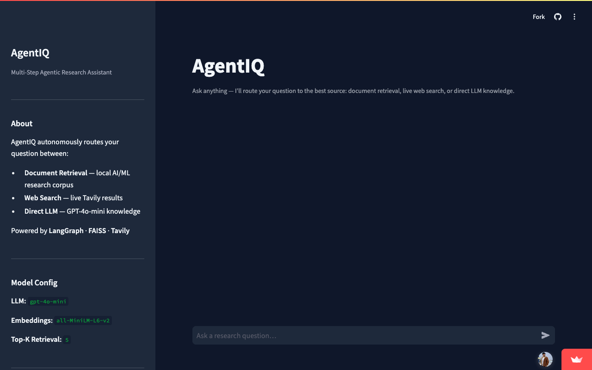

# AgentIQ — Multi-Step Agentic Research Assistant

> An agentic AI system that autonomously routes queries between document retrieval, vector search, and live web search to generate grounded, cited answers.


[](https://github.com/vamsi513/agentiq/actions/workflows/ci.yml)

---

## Live Demo

**[AgentIQ on Streamlit Cloud](https://agentiq-qgjmzy665qcpysoctz7app.streamlit.app)**

---

## Screenshots

### App overview



---

## Architecture

```
                        ┌─────────────────────────────────────┐
                        │           User Query                 │
                        └──────────────┬──────────────────────┘
                                       │
                        ┌──────────────▼──────────────────────┐
                        │         Router Node                  │
                        │   (LLM classifies query intent)      │
                        └──────┬───────────────┬──────────────┘
                               │               │              │
              ┌────────────────▼──┐   ┌────────▼────────┐  ┌─▼──────────────┐
              │  FAISS / Pinecone │   │  Tavily Web     │  │  Direct LLM    │
              │  + LlamaIndex     │   │  Search         │  │  (GPT-4o-mini) │
              │  (local corpus)   │   │  (live results) │  │                │
              └────────────────┬──┘   └────────┬────────┘  └─┬──────────────┘
                               │               │              │
                        ┌──────▼───────────────▼──────────────▼──────┐
                        │              Generator Node                  │
                        │   (synthesises context → cited answer)       │
                        └──────────────────┬──────────────────────────┘
                                           │
                        ┌──────────────────▼──────────────────────────┐
                        │         Streamed Response + Citations        │
                        │         (via FastAPI SSE / Streamlit)        │
                        └─────────────────────────────────────────────┘

  Memory: MemorySaver checkpoints every turn → full multi-turn history per session
  Observability: LangSmith traces every graph run end-to-end
```

---

## Features

- **Multi-step agentic reasoning** with LangGraph StateGraph — router, retriever, web search, and generator nodes wired with conditional edges
- **FAISS retrieval** — primary backend with L2-normalized embeddings for cosine similarity; experimental Pinecone and LlamaIndex adapters included as alternative backends
- **In-process session memory** with LangGraph MemorySaver checkpointing across all turns in a session (process-local; not persisted across restarts)
- **Real-time streaming responses** via FastAPI Server-Sent Events (SSE) with token-level output
- **LangSmith observability** — every graph run is traced end-to-end with inputs, outputs, latency, and token usage
- **RAGAS evaluation** — answer relevance **0.68**, faithfulness **0.69** across 50 multi-hop QA pairs
- **PDF upload** — users can upload their own PDFs; text is extracted, chunked, and indexed into FAISS at runtime
- **LoRA fine-tuning notebook** — `notebooks/finetune_lora.ipynb` demonstrates full PEFT/LoRA fine-tuning on a custom Q&A dataset
- **Kubernetes manifests** — `k8s/` directory contains Deployment, Service/Ingress, and HPA manifests as a deployment reference
- **API rate limiting** — 30 requests/minute per IP enforced at the FastAPI layer; trusted-proxy-aware `X-Forwarded-For` handling for deployments behind nginx

---

## Tech Stack

| Category | Technology |
|---|---|
| Agent Orchestration | LangGraph 0.2.28 |
| LLM Abstraction | LangChain 0.3.7 |
| Language Model | OpenAI GPT-4o-mini |
| Embeddings | sentence-transformers all-MiniLM-L6-v2 |
| Vector Store (local) | FAISS faiss-cpu 1.13.0 |
| Vector Store (cloud) | Pinecone |
| Document Indexing | LlamaIndex (llama-index-core) |
| Web Search | Tavily Search API |
| Observability | LangSmith |
| Backend API | FastAPI 0.115.4 + uvicorn |
| Streaming | Server-Sent Events (SSE) |
| Data Validation | Pydantic v2 |
| Frontend | Streamlit 1.40.0 |
| Evaluation | RAGAS |
| Fine-tuning | PEFT / LoRA (Hugging Face) |
| Container Orchestration | Kubernetes (Deployment + HPA + Ingress) |
| Testing | pytest |
| Language | Python 3.11 |

---

## Quick Start

### 1. Clone the repository

```bash
git clone https://github.com/vamsi513/agentiq.git
cd agentiq
```

### 2. Create a virtual environment

```bash
python -m venv .venv
source .venv/bin/activate        # macOS / Linux
# .venv\Scripts\activate         # Windows
```

### 3. Install dependencies

```bash
pip install -r requirements.txt
```

### 4. Configure environment variables

```bash
cp .env.example .env
# Edit .env and add your API keys
```

### 5. Run the Streamlit app

```bash
streamlit run app.py
```

The app opens at `http://localhost:8501`. The FAISS index is built automatically on first run (~30 seconds).

### 6. (Optional) Run the FastAPI backend separately

```bash
uvicorn api.main:app --host 0.0.0.0 --port 8000 --reload
```

API docs at `http://localhost:8000/docs`.

### 7. Run tests

```bash
pytest tests/ -v
```

---

## Environment Variables

```env
# Required
OPENAI_API_KEY=sk-your-openai-api-key-here
TAVILY_API_KEY=tvly-your-tavily-api-key-here

# Observability (optional)
LANGCHAIN_API_KEY=your-langsmith-api-key
LANGCHAIN_TRACING_V2=true
LANGCHAIN_PROJECT=agentiq

# Pinecone (optional — uses FAISS by default)
PINECONE_API_KEY=your-pinecone-api-key
PINECONE_INDEX=agentiq-docs
PINECONE_ENV=us-east-1

# Model defaults
OPENAI_MODEL=gpt-4o-mini
EMBEDDING_MODEL=all-MiniLM-L6-v2
MAX_TOKENS=1024
TEMPERATURE=0.2
TOP_K_RETRIEVAL=5
MAX_WEB_RESULTS=5
LOG_LEVEL=INFO
```

---

## Project Structure

```
agentiq/
├── app.py                          # Streamlit frontend entry point
├── config.py                       # Central config — loads from .env
├── requirements.txt                # Pinned runtime dependencies
├── Dockerfile                      # Container image
├── agent/
│   ├── graph.py                    # LangGraph StateGraph with conditional routing
│   ├── nodes.py                    # Router, retriever, web_search, generator nodes
│   ├── state.py                    # AgentState TypedDict
│   └── memory.py                   # MemorySaver + thread management
├── retrieval/
│   ├── vectorstore.py              # FAISS index: build, persist, query
│   ├── embeddings.py               # sentence-transformers wrapper
│   ├── llamaindex_loader.py        # LlamaIndex VectorStoreIndex (alternative pipeline)
│   ├── pinecone_store.py           # Pinecone cloud vector store
│   └── documents/
│       └── sample_docs.txt         # 30 AI/ML research documents
├── observability/
│   └── langsmith_tracer.py         # LangSmith tracing: setup, trace_run, feedback
├── tools/
│   └── web_search.py               # Tavily API wrapper
├── api/
│   ├── main.py                     # FastAPI app — /chat, /chat/stream, /health
│   ├── schemas.py                  # Pydantic request/response models
│   └── streaming.py                # SSE streaming helper
├── k8s/
│   ├── deployment.yaml             # Kubernetes Deployment + PVC
│   ├── service.yaml                # ClusterIP Service + Nginx Ingress
│   └── hpa.yaml                    # HorizontalPodAutoscaler (2–8 replicas)
├── notebooks/
│   └── finetune_lora.ipynb         # LoRA/PEFT fine-tuning walkthrough
├── evaluation/
│   ├── eval_runner.py              # RAGAS evaluation pipeline
│   └── test_queries.json           # 50 curated QA pairs
└── tests/
    ├── test_agent.py
    ├── test_api.py
    ├── test_retrieval.py
    └── test_tools.py
```

---

## Evaluation Results

Evaluated on 50 curated AI/ML multi-hop question-answer pairs using RAGAS.

| Metric | Score |
|---|---|
| Answer Relevancy | **0.6847** |
| Faithfulness | **0.6862** |
| Queries Evaluated | **50** |
| Avg Latency | **6628ms** |

### Route distribution across 50 queries

| Route | Count | % |
|---|---|---|
| Document Retrieval | 50 | 100% |

```bash
python -m evaluation.eval_runner
```

A **deterministic retrieval evaluation** (no API key required) runs automatically in CI on every push — `tests/test_retrieval_eval.py` checks hit rate across 25 retrieval queries against the FAISS index.

The full RAGAS pipeline can be triggered manually via the **RAGAS Evaluation** workflow in GitHub Actions — it SSHes into EC2 and runs the evaluation there using API keys stored in the server's `.env` file.

---

## How It Works

### Router Node
Receives the user query and uses GPT-4o-mini to decide between `retrieval`, `web_search`, or `direct`. Unknown responses default to `retrieval`.

### Retriever Node
Queries the FAISS vector index (or Pinecone if configured). The query is encoded with `all-MiniLM-L6-v2`, L2-normalised, and searched via cosine similarity. LlamaIndex provides an alternative ingestion and retrieval path for directory-based document loading.

### Web Search Node
Calls Tavily with `search_depth="advanced"`. Falls back gracefully if Tavily is unavailable — the app never crashes.

### Generator Node
Receives the assembled context and full conversation history. Constructs a grounded prompt for GPT-4o-mini with inline citation instructions.

### LangSmith Observability
`configure_tracing()` is called at app startup. When `LANGCHAIN_API_KEY` is set, every graph run — including intermediate node transitions, token counts, and latencies — is streamed to LangSmith.

### Memory (MemorySaver)
Every graph run is checkpointed under the session's `thread_id`. The full state graph is restored on each invocation for multi-turn coherence.

---

## API Reference

| Method | Endpoint | Description |
|---|---|---|
| `GET` | `/health` | Liveness check |
| `POST` | `/chat` | Full JSON response |
| `POST` | `/chat/stream` | Token-by-token SSE stream |

```bash
curl -X POST http://localhost:8000/chat \
  -H "Content-Type: application/json" \
  -d '{"query": "What is RAG?", "session_id": "session-1"}'
```

---

## Deployment

### Streamlit Cloud

1. Push repository to GitHub
2. Go to [share.streamlit.io](https://share.streamlit.io), connect the repo, set main file to `app.py`
3. Under **Advanced settings → Secrets**, add `OPENAI_API_KEY` and `TAVILY_API_KEY`

### AWS EC2 (via GitHub Actions CI/CD)

Every push to `master` triggers a GitHub Actions pipeline:

1. Runs the full test suite
2. Builds the Docker image (catches broken images before they reach the server)
3. Deploys to EC2 via SSH — pulls the exact tested commit, rebuilds, and restarts the container
4. Runs a health check loop (`GET /health`) — if the app fails to start, the old image is automatically restored

Required GitHub Secrets: `EC2_HOST`, `EC2_SSH_KEY`

### Kubernetes

```bash
kubectl apply -f k8s/deployment.yaml
kubectl apply -f k8s/service.yaml
kubectl apply -f k8s/hpa.yaml
```

Create the secrets first:

```bash
kubectl create secret generic agentiq-secrets \
  --from-literal=openai-api-key=sk-... \
  --from-literal=tavily-api-key=tvly-... \
  -n agentiq
```

---

## License

MIT License — see [LICENSE](LICENSE) for details.

---

## Author

Built by [Vamsi Krishna Sadu](https://github.com/vamsi513)

*[Live Demo](https://agentiq-qgjmzy665qcpysoctz7app.streamlit.app) · [GitHub](https://github.com/vamsi513/agentiq)*
